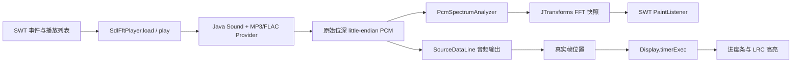

# MusicPlayer

一个面向源码学习的本地桌面音乐播放器。项目使用 Java 25、SWT、Java Sound 和 SQLite，覆盖音频解码、PCM 播放、FFT 频谱、LRC 歌词同步、播放列表持久化与系统托盘等典型桌面开发主题。

## 功能概览

- 播放本地 MP3、FLAC、WAV 等 Java Sound 可识别的音频；
- 歌曲列表上方提供“添加歌曲”按钮，可从本地选择文件并写入播放列表；
- 单击歌曲只改变选择，双击才开始播放；双击到文件已缺失的歌曲时，可选择只删除 SQLite 中的播放列表记录，不会删除音频或歌词文件；
- 上一曲左侧提供与切歌按钮同尺寸的播放模式图标，每点击一次按“顺序播放 → 随机播放 → 单曲循环 → 顺序播放”切换，悬停显示当前模式；每次启动默认顺序播放，切换模式不打断当前歌曲；
- 顺序播放按列表向后跳过缺失文件，最后一首结束后停止；随机播放从可用歌曲中选择，存在其他可用歌曲时不连续重复当前歌曲；单曲循环在当前文件仍可用时自动重播；
- 支持上一曲、下一曲、暂停和继续；顺序播放和单曲循环下手动切歌仍按列表方向跳过缺失文件并保留首尾回绕，随机模式下手动切歌也随机选择；
- 根据真实音频帧位置刷新进度和歌词；细进度条支持点击跳转，暂停时跳转仍保持暂停；
- 进度条右侧提供音量图标，点击向上展开竖向音量条，支持点击、拖动和 0～100% 调节；0% 为静音，再次点击图标、点击外部或按 Esc 收起；
- 音量默认 100%，切歌、暂停和进度跳转后保持当前值，仅在本次运行期间有效；
- 实时计算 FFT 频谱并在 SWT 画布上绘制；
- 自动匹配同名 `.lrc` 歌词并按时间标签同步；
- 使用 SQLite 保存歌曲路径、作者、时长和排序；
- 支持最小化、托盘恢复和关闭时释放音频资源。

文件选择器会显示 MP3、WAV、FLAC 和 PCM 文件，但最终能否解码仍取决于文件编码以及当前 Java Sound Provider；扩展名本身不代表一定可播放。

## 环境要求

- JDK 25；
- Maven 3.9 或更高版本；
- 64 位 Windows、Linux 或 macOS；
- 可用的系统音频输出设备。

### 关键依赖版本

| 组件 | 版本 |
| --- | --- |
| Hutool | 5.8.47 |
| SQLite JDBC | 3.53.2.1 |
| JTransforms | 3.2 |
| Eclipse JFace | 3.39.100 |
| Eclipse SWT | 3.134.0 |
| SLF4J | 2.0.18 |

项目保留 MP3SPI 1.9.5.4、JFLAC 1.5.2 和 JUnit 4.13.2。依赖升级只采用稳定版本，不使用 Alpha、Milestone 等预发布版本，也不引入与当前需求无关的新主版本。

项目以 Java 25 为发布目标；最终自动验证使用 JDK 25.0.4 和 Maven 3.9.16。

Maven 会按当前操作系统和 JVM 架构自动选择 SWT：

| Profile | 平台 | SWT artifact | 当前验证范围 |
| --- | --- | --- | --- |
| `windows-x64` | Windows x64 | `org.eclipse.swt.win32.win32.x86_64` | 测试、打包与 JAR 内容 |
| `linux-x64` | Linux x64 | `org.eclipse.swt.gtk.linux.x86_64` | 隔离 Profile 编译与打包 |
| `macos-x64` | macOS Intel | `org.eclipse.swt.cocoa.macosx.x86_64` | 隔离 Profile 编译与打包 |
| `macos-arm64` | macOS Apple Silicon | `org.eclipse.swt.cocoa.macosx.aarch64` | 隔离 Profile 编译与打包 |

未列出的系统或 CPU 架构不会自动获得 SWT 原生依赖。Linux 和 macOS 的交叉打包在 Windows 上完成，尚未在对应真机完成 UI 与音频冒烟验证。

## 构建与运行

所有命令都应在项目根目录执行，因为数据库和示例音频使用相对路径。

```powershell
mvn clean test
mvn package
java --enable-native-access=ALL-UNNAMED -jar target/MusicPlayer-2.0.0.0.jar
```

`--enable-native-access=ALL-UNNAMED` 允许 SQLite JDBC 加载随依赖提供的原生库，并消除新版本 JDK 的受限原生访问警告。macOS 启动 SWT 时还需要把主线程参数放在最前面：

```bash
java -XstartOnFirstThread --enable-native-access=ALL-UNNAMED \
  -jar target/MusicPlayer-2.0.0.0.jar
```

Shade 插件生成的是包含 Java 依赖、当前平台 SWT 和图片资源的可执行 JAR。以下内容仍是外部运行数据，不能只复制 JAR：

- `lib/sqlite/db/MusicPlayer.db`；
- `lib/song/` 中的示例歌曲与歌词。

SWT 3.134 的 `Library.isLoadable` 从 Shade JAR 加载原生库时，需要 Manifest 提供与目标平台一致的 `SWT-OS` 和 `SWT-Arch`。各 Maven Profile 会通过 Shade 写入这两个属性；[`scripts/verify-shaded-jar.ps1`](scripts/verify-shaded-jar.ps1) 会同时检查它们、主类、添加歌曲图标和目标平台 SWT 原生库。脚本的操作系统与架构参数均为必填，例如验证两个 macOS 包：

```powershell
& '.\scripts\verify-shaded-jar.ps1' -NativePattern '\.(jnilib|dylib)$' -ExpectedSwtOS macosx -ExpectedSwtArchitecture x86_64
& '.\scripts\verify-shaded-jar.ps1' -NativePattern '\.(jnilib|dylib)$' -ExpectedSwtOS macosx -ExpectedSwtArchitecture aarch64
```

## 播放链路



入口是 `com.xu.music.player.main.MusicPlayer`。SWT 事件循环负责窗口事件，播放和频谱任务运行在独立虚拟线程中；后台线程不直接修改 SWT 控件，周期状态通过 `Display.timerExec` 读取播放器快照，自然完成通知通过 `Display.asyncExec` 回到 UI 线程。

## 建议学习顺序

### 1. SWT 事件循环与 UI 线程

从 [`MusicPlayer`](src/main/java/com/xu/music/player/main/MusicPlayer.java) 开始。`open()` 中的 `readAndDispatch()` / `sleep()` 是 SWT 事件循环；鼠标监听器处理播放控制；`timerExec(100, task)` 在 UI 线程周期刷新进度、歌词和重绘请求。

需要记住：SWT 控件只能由创建它们的 UI 线程访问。这里没有从播放线程直接更新控件，而是让 UI 定时读取 `Player.position()` 和 `spectrumSnapshot()`。

### 2. Java Sound、PCM 与输出设备

[`SdlFftPlayer`](src/main/java/com/xu/music/player/player/SdlFftPlayer.java) 使用 Java Sound 打开文件，将输入统一转换为小端、16 位有符号 PCM，再把按帧对齐的数据写入 `SourceDataLine`。

一个 PCM frame 包含同一时刻的所有声道样本，因此缓冲区长度必须是 `frameSize` 的整数倍。播放位置来自定位偏移量加上 `(getLongFramePosition() - 定位时设备帧位置) / frameRate`，不会像手工累加计时器那样在暂停或 UI 卡顿时漂移。点击跳转会在播放线程重新打开并解码音频至目标位置，保留播放或暂停状态，同时清空旧音频缓冲区。

MP3 由 `mp3spi` 提供 Java Sound SPI，FLAC 由 `jflac-codec` 提供解码支持。应用层仍使用统一的 `AudioInputStream`，这正是 Provider/SPI 模型的价值。

### 3. 虚拟线程与播放会话

每次加载歌曲都会创建一个 [`PlaybackSession`](src/main/java/com/xu/music/player/player/PlaybackSession.java)，由它独占输入流、音频行、PCM 格式、频谱分析器和任务引用。播放任务和频谱任务通过 `Thread.ofVirtual()` 启动并捕获自己的 Session。

切歌时，`PlaybackSessionSlot` 原子替换当前 Session，再关闭旧资源。旧任务结束时只能清理自己，不能清空新 Session。这解决了快速切歌时旧线程读取新流、关闭新音频行等竞态。虚拟线程适合这里的阻塞读取与周期等待；FFT 本身是 CPU 计算，使用虚拟线程并不会让一次 FFT 更快。

自然播放结束也遵循同样的会话边界。`SdlFftPlayer.play()` 在启动播放任务时为当前 Session 快照完成回调；`MusicPlayer` 则为每次播放绑定一个捕获不可变 `request generation` 的闭包。播放虚拟线程检测到 EOF 后只提交完成通知，再通过 `Display.asyncExec` 回到 SWT UI 线程；UI 同时校验代次仍是最新且播放器已经停止，拒绝旧 Session 延迟到达的 EOF，避免快速切歌后误触发下一曲。

### 4. PCM 取样与 FFT

[`PcmSpectrumAnalyzer`](src/main/java/com/xu/music/player/player/PcmSpectrumAnalyzer.java) 按 PCM frame 解码 16 位样本，多声道取平均后写入环形缓冲区。缓冲区填满后，JTransforms 执行实数 FFT，并一次性发布新的 `double[]` 频谱快照。

`spectrumSnapshot()` 返回副本，UI 不会观察到后台线程正在 `clear/add` 的中间状态。绘制端使用对数频率映射，让有限数量的柱形条在低频区域保留更多细节。

### 5. LRC 解析与同步

[`LrcParser`](src/main/java/com/xu/music/player/lyric/LrcParser.java) 是无 SWT 依赖的纯函数：正则提取 `[mm:ss.xx]`，非法行被忽略，结果按秒排序并保存为 `LrcLine` record。切歌时先清空旧歌词状态，再加载新文件，防止无歌词歌曲继续显示上一首内容。

UI 刷新时用真实播放位置查找“不晚于当前位置的最后一行”，更新高亮并滚动表格。

### 6. SQLite、参数化 SQL 与反射映射

[`QueryWrapper`](src/main/java/com/xu/music/player/wrapper/QueryWrapper.java)、`InsertWrapper` 和 `UpdateWrapper` 只组装 SQL 结构，值统一保存到不可变的 [`SqlCommand`](src/main/java/com/xu/music/player/wrapper/sql/SqlCommand.java) record 中，并通过 `PreparedStatement` 绑定。歌曲名包含单引号时也不会破坏 SQL。

[`NewHelper`](src/main/java/com/xu/music/player/wrapper/sql/NewHelper.java) 负责连接、资源关闭和结果映射。SQLite 的 `snake_case` 列名会匹配 Java 字段，文本时间按目标字段类型转换为 `Date`、`LocalDateTime`、`LocalDate` 或 `LocalTime`。

这些 Wrapper 是项目内的轻量学习实现，不是通用 ORM。表名和字段名会经过 SQL 标识符校验，条件只暴露受控的等值与模糊匹配操作，数据值始终作为参数传入。

### 7. Java 25 代码阅读点

项目不启用预览特性，使用的现代 Java 写法包括：

- `LrcLine`、`SqlCommand` record 表达不可变数据；
- `NewHelper.setValues()` 的类型模式 `switch`；
- `Thread.ofVirtual()` 创建命名虚拟线程；
- `var`、`Stream.toList()`、`List.getFirst()` 和 `Math.clamp()`；
- `AutoCloseable` 与 try-with-resources 管理数据库和音频资源。

重点不是追求新语法数量，而是让类型、所有权和生命周期更明确。

## 目录导览

```text
src/main/java/com/xu/music/player/
├─ main/       SWT 主窗口、播放列表导航和进度计算
├─ player/     播放器接口、播放会话、PCM 与 FFT
├─ lyric/      LRC 数据模型和纯解析器
├─ wrapper/    参数化 SQL Wrapper
├─ entity/     SQLite 实体
├─ window/     本地歌曲选择与导入
├─ taskbar/    Windows 透明任务栏歌词窗口
├─ tray/       系统托盘
└─ utils/      SWT 图片、字体、时间与绘制工具

src/main/resources/                图片与日志配置
src/test/java/                     不依赖声卡的单元测试
lib/sqlite/db/MusicPlayer.db       播放列表数据库
lib/song/                          示例音频与歌词
```

## 歌词与 Windows 任务栏

- 双击歌曲后在后台打开音频设备、加载音频和歌词；快速连续切歌只接受最新请求，加载过程中主窗口不等待解码锁。
- 当前歌词为蓝色文字，保留原来的当前行灰色背景和其他行样式。首尾均预留空行，使当前行位于视口中部（原生表格按整行滚动，误差不超过半行）。
- 同一句歌词的进度更新不会重新滚动；换句、前后定位或窗口尺寸改变时重新居中。
- Windows 下右击托盘，勾选“任务栏歌词”。有歌词时显示当前句，无歌词时显示歌曲名称和歌手。
- 默认锁定并鼠标穿透；取消“锁定歌词位置（鼠标穿透）”后，可横向拖动、滚轮调宽，也可用菜单调整宽度或重置。
- 托盘菜单继续使用 SWT 原生控件，以 SWT 的屏幕逻辑坐标定位，不跨 AWT/Win32 坐标系换算。

任务栏歌词是独立透明窗口，不向 Explorer 注入。当前仅支持 Windows 主屏横向任务栏；自动隐藏收起或前台全屏时隐藏，不自动避让每一个任务栏图标，位置及宽度尚未跨启动保存。非 Windows 平台不显示任务栏歌词菜单。

## FLAC 位深与跨平台音频输出

Windows、Linux、macOS 使用同一套 Java Sound 解码、输出选择和 PCM 处理代码，不引入平台专用音频库。

- 默认保留采样率、声道数和已知位深，24 位 FLAC 不会自动降成 16 位。
- 音量和频谱支持 8/16/24/32 位小端有符号 PCM；FLAC 可解码的位深仍受 JFLAC Provider 限制，当前回归覆盖 16 位和 24 位。
- 100% 软件音量直接复制采样字节；降低音量会改变采样值。频谱只读取数据，不改变音频输出。
- 当前 Java Sound 输出通道不支持原始格式、但支持同采样率/声道的 16 位格式时，弹窗询问是否仅对本次播放启用兼容模式。选择“否”保持停止，选择“是”才降位深；切歌后重新按原始精度请求。
- 进度条上方显示源格式与实际打开的 Java Sound 通道格式，降位深时标注“兼容”；悬停可查看完整说明。
- 打开设备失败不会被当成格式不支持而悄悄降级。没有可用兼容格式时明确报错。
- Java Sound 接受 24 位不等于系统端到端位精确输出；系统共享混音、驱动或设备仍可能转换。当前未实现 WASAPI/CoreAudio/ALSA 独占模式。

### 构建与验证范围

`.github/workflows/build.yml` 配置 Windows、Linux、macOS 三系统 JDK 25 构建与无设备依赖测试；推送后由 CI 执行，工作流文件本身不是三端运行通过的证明。

从 Windows 交叉打包时显式关闭 Windows Profile，并使用独立目录，避免混入其他平台的 SWT 或覆盖本机产物：

```powershell
mvn verify "-P!windows-x64,linux-x64" "-Dmusicplayer.buildDirectory=target/platform-check/linux-x64"
mvn verify "-P!windows-x64,macos-x64" "-Dmusicplayer.buildDirectory=target/platform-check/macos-x64"
mvn verify "-P!windows-x64,macos-arm64" "-Dmusicplayer.buildDirectory=target/platform-check/macos-arm64"
```

这些交叉构建验证源代码、测试和平台依赖打包，不代表在目标系统打开了设备或窗口。目标系统使用自己的构建包；macOS 启动 SWT 仍需 `-XstartOnFirstThread`。

真实设备验证可在三系统分别执行（静音测试，不访问用户歌曲和数据库）：

```text
mvn test -Dtest=AudioOutputDeviceTest -Dmusicplayer.audioTests=true
```

回归样本包含非零低八位的 24 位 FLAC，测试逐采样验证精度、音量、频谱、前后跳转和资源释放。真机验收还需检查：不支持格式时取消/接受弹窗、实际播放与暂停/跳转、连续切歌，以及 UI 显示的源格式和输出格式。

## 数据库模型

`song` 表的主要字段如下：

| 字段 | 用途 |
| --- | --- |
| `id` | 歌曲主键 |
| `name`、`author`、`info` | 展示信息 |
| `index`、`flag` | 排序与状态 |
| `length` | 导入时读取的时长，单位为秒 |
| `song_path`、`lyric_path` | 外部音频和歌词路径 |
| `lyric_info` | 预留歌词文本 |
| `create_by/time`、`update_by/time` | 审计信息 |

数据库文件会被应用写入。测试中的临时数据库用于验证日期映射，仓库数据库测试则保证内置歌曲和歌词路径实际存在。

## 测试

`mvn test` 默认执行测试，不再跳过。测试覆盖：

- 播放列表前后回绕、空列表，以及按方向有界扫描并跳过缺失歌曲；
- 自然 EOF 通知只接受当前 Session，播放请求代次会过滤过期完成回调；
- `PlaylistSnapshot` 在刷新列表后按歌曲 ID 恢复当前播放项，并保持快照不可变；
- LRC 解析、非法行和排序；
- PCM 单/双声道解码及频谱快照隔离；
- Session 原子替换、暂停、位置和幂等关闭；
- 进度百分比和点击时间换算边界；
- 前后跳转、连续点击、暂停定位、旧缓冲丢弃和定位资源释放；
- 竖向音量条坐标换算、PCM 音量缩放、精确静音、部分写入，以及跨会话和跳转时的音量保持；
- SQL 占位符、单引号参数、日期映射，以及 Helper 的 insert/update/delete 分派；
- 删除歌曲记录只修改 SQLite，不删除对应音频文件；
- 示例数据库中的外部文件路径。

默认测试不打开真实声卡；显式启用的 `AudioOutputDeviceTest` 除外。`SourceDataLine` 用测试替身验证生命周期，因此 CI 或无音频设备环境也能运行；真实设备、托盘和窗口交互仍需要目标平台冒烟测试。

新增回归测试覆盖异步加载与过期请求释放、歌词时间边界与居中留白、任务栏缩放坐标和穿透窗口样式。默认跳过需要真实桌面的测试；Windows 桌面可显式运行：

```powershell
mvn test "-Dmusicplayer.desktopTests=true" "-Dtest=CenteredLyricsDesktopTest,WindowsTaskbarDesktopTest"
```

上述桌面测试验证原生表格首尾/调整尺寸后的居中、同一句不重复滚动，以及歌词窗口不抢焦点和穿透切换，不打开声卡或访问歌曲数据库。托盘溢出区、多显示器不同缩放、实际音频播放仍需手动验收。

## 已知边界

- 默认数据库和媒体路径依赖项目根目录，尚未迁移到用户数据目录；
- Shade JAR 只包含构建平台的 SWT 原生实现，不是一个跨平台通用 JAR；
- Linux/macOS 只完成了隔离 Profile 的编译和打包，UI、托盘和音频设备仍需对应真机验证；
- 进度条支持点击定位，暂不支持拖动；文件和 URL 加载支持 seek，不可重新打开的音频流不支持；`resume(long)` 的参数保留但当前只执行继续播放；
- 搜索框和在线音乐能力未实现；
- SWT 字体的下划线/删除线反射代码含 Windows 内部类型，常规字体创建不受影响，但该高级样式不是跨平台保证。

## 可继续练习

1. 把数据库和歌曲索引迁移到每个操作系统的用户数据目录。
2. 将 `MusicPlayer` 拆分为 View、播放控制器和播放列表服务，并为控制器增加测试。
3. 增加 seek 和音频设备切换。
4. 为频谱加入窗函数、平滑和固定 dB 标度，对比不同参数的视觉效果。
5. 在 Linux/macOS CI 或真机补充启动与资源加载测试，形成真实的平台兼容矩阵。
