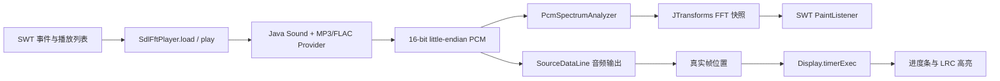

# MusicPlayer

一个面向源码学习的本地桌面音乐播放器。项目使用 Java 25、SWT、Java Sound 和 SQLite，覆盖音频解码、PCM 播放、FFT 频谱、LRC 歌词同步、播放列表持久化与系统托盘等典型桌面开发主题。

## 功能概览

- 播放本地 MP3、FLAC、WAV 等 Java Sound 可识别的音频；
- 上一曲、下一曲、暂停和继续，播放列表首尾循环；
- 根据真实音频帧位置刷新进度和歌词；
- 实时计算 FFT 频谱并在 SWT 画布上绘制；
- 自动匹配同名 `.lrc` 歌词并按时间标签同步；
- 使用 SQLite 保存歌曲路径、作者、时长和排序；
- 支持最小化、托盘恢复和关闭时释放音频资源。

文件选择器会显示 MP3、WAV、FLAC 和 PCM 文件，但最终能否解码仍取决于文件编码以及当前 Java Sound Provider；扩展名本身不代表一定可播放。

## 环境要求

- JDK 25；
- Maven 3.9 或更高版本；
- 64 位 Windows、Linux 或 macOS；
- 可用的系统音频输出设备。

Maven 会按当前操作系统和 JVM 架构自动选择 SWT：

| Profile | 平台 | SWT artifact | 当前验证范围 |
| --- | --- | --- | --- |
| `windows-x64` | Windows x64 | `org.eclipse.swt.win32.win32.x86_64` | 测试、打包与 JAR 内容 |
| `linux-x64` | Linux x64 | `org.eclipse.swt.gtk.linux.x86_64` | 隔离 Profile 编译与打包 |
| `macos-x64` | macOS Intel | `org.eclipse.swt.cocoa.macosx.x86_64` | 隔离 Profile 编译与打包 |
| `macos-arm64` | macOS Apple Silicon | `org.eclipse.swt.cocoa.macosx.aarch64` | 隔离 Profile 编译与打包 |

未列出的系统或 CPU 架构不会自动获得 SWT 原生依赖。Linux 和 macOS 的交叉打包在 Windows 上完成，尚未在对应真机完成 UI 与音频冒烟验证。

## 构建与运行

所有命令都应在项目根目录执行，因为数据库和示例音频使用相对路径。

```powershell
mvn clean test
mvn package
java --enable-native-access=ALL-UNNAMED -jar target/MusicPlayer-2.0.0.0.jar
```

`--enable-native-access=ALL-UNNAMED` 允许 SQLite JDBC 加载随依赖提供的原生库，并消除新版本 JDK 的受限原生访问警告。macOS 启动 SWT 时还需要把主线程参数放在最前面：

```bash
java -XstartOnFirstThread --enable-native-access=ALL-UNNAMED \
  -jar target/MusicPlayer-2.0.0.0.jar
```

Shade 插件生成的是包含 Java 依赖、当前平台 SWT 和图片资源的可执行 JAR。以下内容仍是外部运行数据，不能只复制 JAR：

- `lib/sqlite/db/MusicPlayer.db`；
- `lib/song/` 中的示例歌曲与歌词。

## 播放链路



入口是 `com.xu.music.player.main.MusicPlayer`。SWT 事件循环负责窗口事件，播放和频谱任务运行在独立虚拟线程中；后台线程不直接修改 SWT 控件，UI 只通过 `Display.timerExec` 读取播放器快照并刷新界面。

## 建议学习顺序

### 1. SWT 事件循环与 UI 线程

从 [`MusicPlayer`](src/main/java/com/xu/music/player/main/MusicPlayer.java) 开始。`open()` 中的 `readAndDispatch()` / `sleep()` 是 SWT 事件循环；鼠标监听器处理播放控制；`timerExec(100, task)` 在 UI 线程周期刷新进度、歌词和重绘请求。

需要记住：SWT 控件只能由创建它们的 UI 线程访问。这里没有从播放线程直接更新控件，而是让 UI 定时读取 `Player.position()` 和 `spectrumSnapshot()`。

### 2. Java Sound、PCM 与输出设备

[`SdlFftPlayer`](src/main/java/com/xu/music/player/player/SdlFftPlayer.java) 使用 Java Sound 打开文件，将输入统一转换为小端、16 位有符号 PCM，再把按帧对齐的数据写入 `SourceDataLine`。

一个 PCM frame 包含同一时刻的所有声道样本，因此缓冲区长度必须是 `frameSize` 的整数倍。播放位置来自 `getLongFramePosition() / frameRate`，不会像手工累加计时器那样在暂停或 UI 卡顿时漂移。

MP3 由 `mp3spi` 提供 Java Sound SPI，FLAC 由 `jflac-codec` 提供解码支持。应用层仍使用统一的 `AudioInputStream`，这正是 Provider/SPI 模型的价值。

### 3. 虚拟线程与播放会话

每次加载歌曲都会创建一个 [`PlaybackSession`](src/main/java/com/xu/music/player/player/PlaybackSession.java)，由它独占输入流、音频行、PCM 格式、频谱分析器和任务引用。播放任务和频谱任务通过 `Thread.ofVirtual()` 启动并捕获自己的 Session。

切歌时，`PlaybackSessionSlot` 原子替换当前 Session，再关闭旧资源。旧任务结束时只能清理自己，不能清空新 Session。这解决了快速切歌时旧线程读取新流、关闭新音频行等竞态。虚拟线程适合这里的阻塞读取与周期等待；FFT 本身是 CPU 计算，使用虚拟线程并不会让一次 FFT 更快。

### 4. PCM 取样与 FFT

[`PcmSpectrumAnalyzer`](src/main/java/com/xu/music/player/player/PcmSpectrumAnalyzer.java) 按 PCM frame 解码 16 位样本，多声道取平均后写入环形缓冲区。缓冲区填满后，JTransforms 执行实数 FFT，并一次性发布新的 `double[]` 频谱快照。

`spectrumSnapshot()` 返回副本，UI 不会观察到后台线程正在 `clear/add` 的中间状态。绘制端使用对数频率映射，让有限数量的柱形条在低频区域保留更多细节。

### 5. LRC 解析与同步

[`LrcParser`](src/main/java/com/xu/music/player/lyric/LrcParser.java) 是无 SWT 依赖的纯函数：正则提取 `[mm:ss.xx]`，非法行被忽略，结果按秒排序并保存为 `LrcLine` record。切歌时先清空旧歌词状态，再加载新文件，防止无歌词歌曲继续显示上一首内容。

UI 刷新时用真实播放位置查找“不晚于当前位置的最后一行”，更新高亮并滚动表格。

### 6. SQLite、参数化 SQL 与反射映射

[`QueryWrapper`](src/main/java/com/xu/music/player/wrapper/QueryWrapper.java)、`InsertWrapper` 和 `UpdateWrapper` 只组装 SQL 结构，值统一保存到不可变的 [`SqlCommand`](src/main/java/com/xu/music/player/wrapper/sql/SqlCommand.java) record 中，并通过 `PreparedStatement` 绑定。歌曲名包含单引号时也不会破坏 SQL。

[`NewHelper`](src/main/java/com/xu/music/player/wrapper/sql/NewHelper.java) 负责连接、资源关闭和结果映射。SQLite 的 `snake_case` 列名会匹配 Java 字段，文本时间按目标字段类型转换为 `Date`、`LocalDateTime`、`LocalDate` 或 `LocalTime`。

这些 Wrapper 是项目内的轻量学习实现，不是通用 ORM。表名和字段名会经过 SQL 标识符校验，条件只暴露受控的等值与模糊匹配操作，数据值始终作为参数传入。

### 7. Java 25 代码阅读点

项目不启用预览特性，使用的现代 Java 写法包括：

- `LrcLine`、`SqlCommand` record 表达不可变数据；
- `NewHelper.setValues()` 的类型模式 `switch`；
- `Thread.ofVirtual()` 创建命名虚拟线程；
- `var`、`Stream.toList()`、`List.getFirst()` 和 `Math.clamp()`；
- `AutoCloseable` 与 try-with-resources 管理数据库和音频资源。

重点不是追求新语法数量，而是让类型、所有权和生命周期更明确。

## 目录导览

```text
src/main/java/com/xu/music/player/
├─ main/       SWT 主窗口、播放列表导航和进度计算
├─ player/     播放器接口、播放会话、PCM 与 FFT
├─ lyric/      LRC 数据模型和纯解析器
├─ wrapper/    参数化 SQL Wrapper
├─ entity/     SQLite 实体
├─ window/     本地歌曲选择与导入
├─ tray/       系统托盘
└─ utils/      SWT 图片、字体、时间与绘制工具

src/main/resources/                图片与日志配置
src/test/java/                     不依赖声卡的单元测试
lib/sqlite/db/MusicPlayer.db       播放列表数据库
lib/song/                          示例音频与歌词
```

## 数据库模型

`song` 表的主要字段如下：

| 字段 | 用途 |
| --- | --- |
| `id` | 歌曲主键 |
| `name`、`author`、`info` | 展示信息 |
| `index`、`flag` | 排序与状态 |
| `length` | 导入时读取的时长，单位为秒 |
| `song_path`、`lyric_path` | 外部音频和歌词路径 |
| `lyric_info` | 预留歌词文本 |
| `create_by/time`、`update_by/time` | 审计信息 |

数据库文件会被应用写入。测试中的临时数据库用于验证日期映射，仓库数据库测试则保证内置歌曲和歌词路径实际存在。

## 测试

`mvn test` 默认执行测试，不再跳过。目前 9 个测试类、21 个测试用例覆盖：

- 播放列表前后回绕与空列表；
- LRC 解析、非法行和排序；
- PCM 单/双声道解码及频谱快照隔离；
- Session 原子替换、暂停、位置和幂等关闭；
- 进度百分比边界；
- SQL 占位符、单引号参数与日期映射；
- 示例数据库中的外部文件路径。

这些测试不打开真实声卡。`SourceDataLine` 用测试替身验证生命周期，因此 CI 或无音频设备环境也能运行；真实设备、托盘和窗口交互仍需要目标平台冒烟测试。

## 已知边界

- 默认数据库和媒体路径依赖项目根目录，尚未迁移到用户数据目录；
- Shade JAR 只包含构建平台的 SWT 原生实现，不是一个跨平台通用 JAR；
- Linux/macOS 只完成了隔离 Profile 的编译和打包，UI、托盘和音频设备仍需对应真机验证；
- 暂不支持拖动进度条 seek，`resume(long)` 的参数保留但当前只执行继续播放；
- 搜索框和在线音乐能力未实现；
- SWT 字体的下划线/删除线反射代码含 Windows 内部类型，常规字体创建不受影响，但该高级样式不是跨平台保证。

## 可继续练习

1. 把数据库和歌曲索引迁移到每个操作系统的用户数据目录。
2. 将 `MusicPlayer` 拆分为 View、播放控制器和播放列表服务，并为控制器增加测试。
3. 增加 seek、播放完成后自动下一曲，以及音频设备切换。
4. 为频谱加入窗函数、平滑和固定 dB 标度，对比不同参数的视觉效果。
5. 在 Linux/macOS CI 或真机补充启动与资源加载测试，形成真实的平台兼容矩阵。
